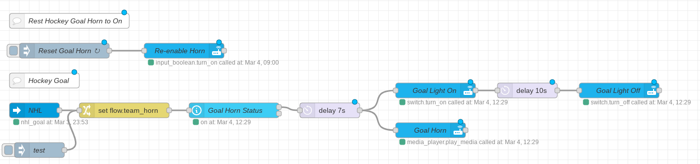

# GoalHorn

This is a Node Red flow that uses  [JayBlackedOut's](https://github.com/JayBlackedOut/hass-nhlapi) goal sensor to trigger our LED strip to flash and play the team goal horn on a Google Home.

The flow triggers on the **nhl_goal** event.  I edited down goal horns I found on Youtube to be around 30 seconds and named each with the team_id that is sent by the event. To use the horns, put them in an accessible directory, I used my HA local directory, under audio/goalhorns.  To get the Google home to play them, I had to use my external URL, and I use [Nabu Casa](https://nabucasa.com/) for that (which works great, by the way and supports Home Assistant.)

I claim no copyright or ownership of the horn sounds, nor the music played with them.
